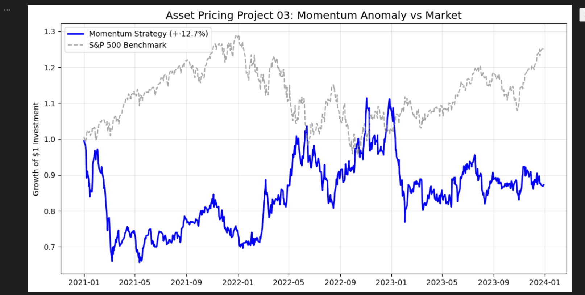

# Asset Pricing Project 03: Cross-Sectional Momentum Strategy

## 📌 Project Overview
This project performs an empirical replication of the **Cross-Sectional Momentum Anomaly**, originally documented by **Jegadeesh & Titman (1993)**.

In standard Asset Pricing theory (CAPM, Fama-French), returns are compensated for *risk*. However, Momentum is considered a **market anomaly** because it suggests that past price information can predict future returns, violating the weak form of the **Efficient Market Hypothesis (EMH)**.

### **Research Question**
> *"Do assets that performed well in the past 12 months ('Winners') continue to outperform assets that performed poorly ('Losers') in the subsequent month?"*

---

## 🔬 Methodology (The Algorithm)

### **1. Investment Universe**
To ensure the strategy is robust across sectors, I selected a diverse basket of 10 liquid Large-Cap equities:
* **Technology:** AAPL, MSFT, GOOGL, AMZN, NVDA
* **Financials:** JPM, BAC
* **Energy:** XOM, CVX
* **Healthcare:** PFE

### **2. Signal Construction**
The momentum signal is calculated using the **(12, 1) strategy**:
* **Lookback Period ($J$):** 12 Months (252 trading days).
* **Ranking:** At the beginning of each month $t$, stocks are ranked based on their cumulative return from $t-12$ to $t-1$.

### **3. Portfolio Construction**
A **Dollar-Neutral Long/Short Portfolio** is constructed:
* **LONG (+):** The Top 3 "Winner" stocks (Equal Weighted).
* **SHORT (-):** The Bottom 3 "Loser" stocks (Equal Weighted).
* **Rebalancing:** Monthly.

$$R_{strategy} = \frac{1}{N} \sum R_{winners} - \frac{1}{N} \sum R_{losers}$$

---

## 📊 Empirical Results (2020–2024)

The backtest covered a period of high market volatility (COVID-19 recovery, Inflation shocks, Interest rate hikes).



### **Performance Analysis**
* **Total Return:** -12.7% (Underperformed S&P 500).
* **Sharpe Ratio:** Negative.

### **Critical Interpretation (Why did it fail?)**
While Momentum is historically robust, it is prone to **"Momentum Crashes"** (Daniel & Moskowitz, 2016) during market reversals.
1.  **2020-2021 Reversal:** The market rebounded sharply from COVID lows. Stocks that were "Losers" (distressed companies) suddenly surged, causing the "Short" leg of the portfolio to lose massive amounts of money.
2.  **High Volatility Regime:** Momentum strategies perform best in stable bull markets. In high-volatility regimes (like 2022), trend signals often break down.

---

## 🛠️ Technical Implementation
The project is implemented in Python using the following stack:
* **`yfinance`**: For fetching adjusted historical price data.
* **`pandas`**: For time-series resampling and vectorization.
* **`numpy`**: For numerical ranking logic.
* **`matplotlib`**: For performance visualization.

### **How to Run**
1.  Install dependencies:
    ```bash
    pip install pandas yfinance matplotlib
    ```
2.  Run the simulation script:
    ```bash
    python momentum_strategy.py
    ```

---

## 📚 References
1.  **Jegadeesh, N., & Titman, S. (1993).** Returns to Buying Winners and Selling Losers: Implications for Stock Market Efficiency. *The Journal of Finance*.
2.  **Daniel, K., & Moskowitz, T. J. (2016).** Momentum Crashes. *Journal of Financial Economics*.
